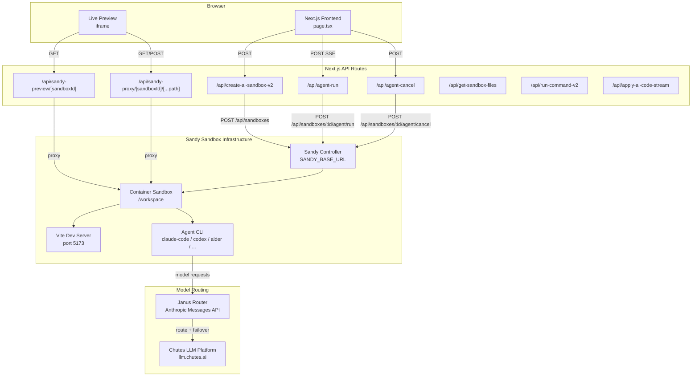
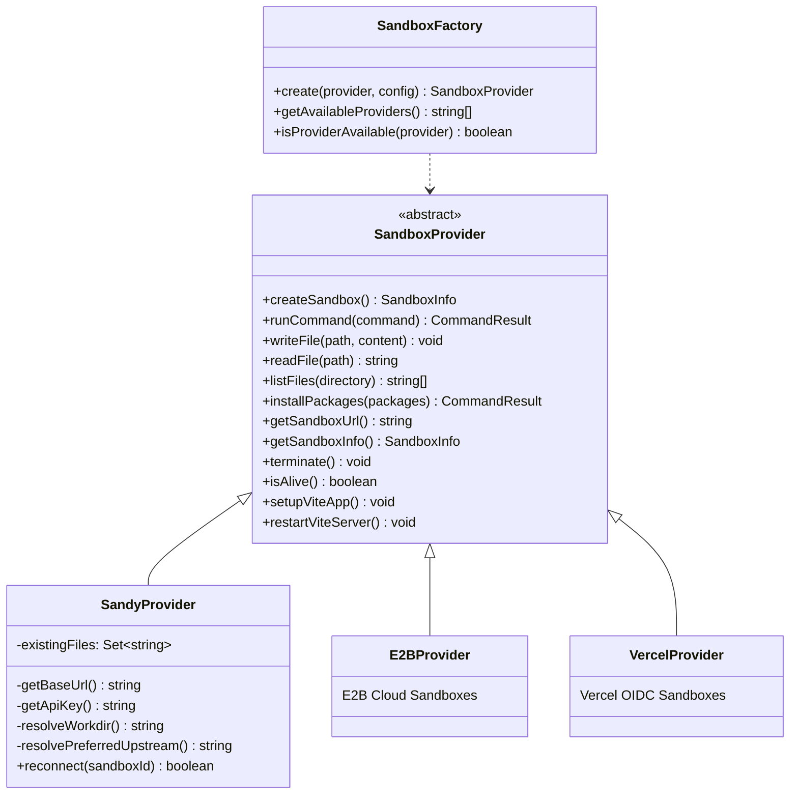
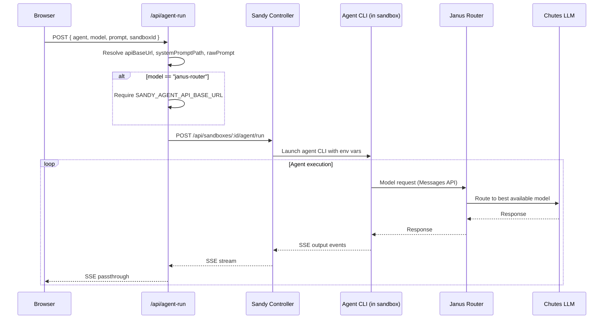
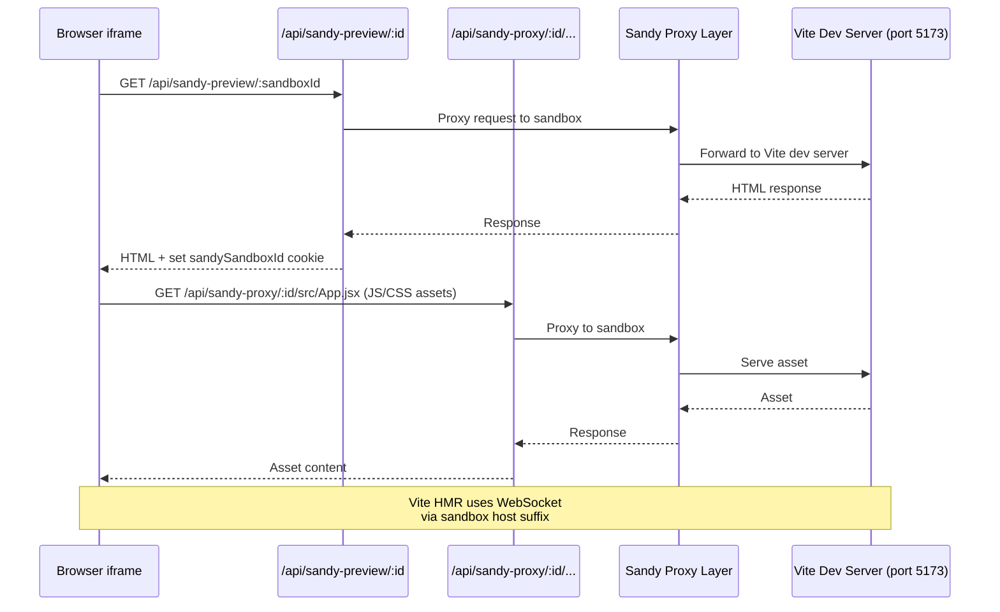

# Chutes Webcoder -- Architecture Overview

Chutes Webcoder is an AI-powered web development IDE forked from
[Open Lovable by Firecrawl](https://github.com/firecrawl/open-lovable). It lets
users describe a React application in natural language, generates code via
multiple AI agents running inside Sandy sandboxes, and renders a live preview of
the result -- all within a single-page Next.js application.

## High-Level Architecture



## Next.js Application Structure

The project uses Next.js App Router with a single main page at `app/page.tsx`
that renders the entire IDE interface. Key structural elements:

| Path | Purpose |
|------|---------|
| `app/page.tsx` | Main IDE page (~256 KB, single-page app) |
| `app/layout.tsx` | Root layout with `AuthProvider`, dark theme, toast notifications |
| `app/api/` | ~35 API route handlers for sandbox, agent, file, and deployment operations |
| `components/` | Shared React components |
| `atoms/` | Jotai atoms for global state management |
| `hooks/` | Custom React hooks (auth, sandbox state, etc.) |
| `lib/` | Server-side libraries (sandbox providers, parsers, auth) |
| `config/app.config.ts` | Central configuration for all sandbox, model, and agent settings |

### Root Layout

```
html (dark mode)
  -> AuthProvider
    -> ConsoleCapture (client error capture)
    -> Page content
    -> Toaster (sonner notifications)
```

## Sandbox Provider Abstraction

Webcoder supports three sandbox backends through a factory pattern:



The default provider is `sandy` (controlled by `SANDBOX_PROVIDER` env var). The
factory falls back from Vercel to Sandy when credentials are missing.

## Multiple Agent Support

Webcoder integrates seven distinct coding agents, all running inside Sandy
sandboxes via the `/api/sandboxes/:id/agent/run` endpoint:

| Agent ID | Name | Runtime | Notes |
|----------|------|---------|-------|
| `builtin` | Chutes Webcoder | In-process | Built-in code generation (no external CLI) |
| `claude-code` | Claude Code | `@anthropic-ai/claude-code` | Routes through `claude.chutes.ai` proxy |
| `codex` | OpenAI Codex | `@openai/codex` | Routes through `responses.chutes.ai` Responses API |
| `aider` | Aider | `aider-chat` (Python) | OpenAI-compatible endpoint at `llm.chutes.ai/v1` |
| `opencode` | OpenCode | `opencode-ai` | Terminal-native agent, multi-provider support |
| `droid` | Factory Droid | `droid` CLI | Requires `FACTORY_API_KEY` |
| `openhands` | OpenHands | `openhands` CLI | OpenAI-compatible endpoint |

The default agent is `codex` (configurable in `config/app.config.ts`).

## Model Routing Through Janus

Agent model requests can be routed through the Janus model router for
intelligent model selection and failover:



Available models (from `config/app.config.ts`):

| Model ID | Display Name |
|----------|-------------|
| `janus-router` | Janus Router (Chutes) -- auto-routes and fails over |
| `zai-org/GLM-4.7-TEE` | GLM 4.7 |
| `deepseek-ai/DeepSeek-V3.2-TEE` | DeepSeek V3.2 |
| `MiniMaxAI/MiniMax-M2.1-TEE` | MiniMax M2.1 |
| `XiaomiMiMo/MiMo-V2-Flash` | MiMo V2 Flash |
| `Qwen/Qwen3-Coder-480B-A35B-Instruct-FP8` | Qwen3 Coder 480B |

## Live Preview Mechanism

The live preview works by proxying the sandbox's Vite dev server output back to
the user's browser through two API routes:



### Vite Setup in Sandbox

When a sandbox is created (`/api/create-ai-sandbox-v2`), the `SandyProvider`
calls `setupViteApp()` which:

1. Checks for a pre-built template at `/opt/sandy/template` (fast path).
2. Otherwise writes `package.json`, `vite.config.js`, `tailwind.config.js`,
   `postcss.config.js`, `index.html`, and starter React files.
3. Runs `npm install` (or copies from template).
4. Writes `vite.config.js` with HMR configured for the sandbox host suffix.
5. Kills any existing Vite process and starts `npm run dev` in the background.
6. Waits for the configured startup delay (default 10 seconds).

The Vite config uses `allowedHosts: true` and file polling (`CHOKIDAR_USEPOLLING`)
for reliable file watching inside containers.

## Key API Endpoints

| Endpoint | Method | Purpose |
|----------|--------|---------|
| `/api/create-ai-sandbox-v2` | POST | Create (or restore) a sandbox with Vite |
| `/api/agent-run` | POST | Run an agent in a sandbox (SSE stream) |
| `/api/agent-cancel` | POST | Cancel a running agent |
| `/api/sandy-preview/[sandboxId]` | GET | Proxy sandbox's root page |
| `/api/sandy-proxy/[sandboxId]/[...path]` | ALL | Proxy any path to sandbox |
| `/api/get-sandbox-files` | GET | List files in the sandbox |
| `/api/sandbox-file` | GET/POST | Read/write individual sandbox files |
| `/api/run-command-v2` | POST | Execute a shell command in sandbox |
| `/api/install-packages-v2` | POST | Install npm packages |
| `/api/restart-vite` | POST | Restart the Vite dev server |
| `/api/check-vite-errors` | GET | Check for Vite build errors |
| `/api/apply-ai-code-stream` | POST | Apply AI-generated code to sandbox |
| `/api/checkpoints` | POST | Save/restore project checkpoints |

## Configuration

All configurable settings are centralized in `config/app.config.ts`:

- **Sandy sandbox**: timeout (10 min), Vite port (5173), working dir (`/workspace`),
  create timeout (240s), setup timeout (240s), startup delay (10s)
- **AI models**: default model, available models, temperature (0.7), max tokens (8000)
- **Agents**: default agent (`codex`), agent display names and descriptions
- **Packages**: legacy peer deps flag, install timeout (180s), auto-restart Vite
- **UI**: model selector visibility, animation duration, max chat messages (100)
- **API**: retry config (3 retries, 1s delay), request timeout (120s)

## Source Files

| File | Purpose |
|------|---------|
| `config/app.config.ts` | Central configuration |
| `lib/sandbox/types.ts` | `SandboxProvider` abstract class and interfaces |
| `lib/sandbox/factory.ts` | `SandboxFactory` -- provider instantiation |
| `lib/sandbox/providers/sandy-provider.ts` | Sandy sandbox provider |
| `lib/sandbox/sandbox-manager.ts` | In-memory sandbox registry (session isolation) |
| `lib/agent-output-parser.ts` | Parse SSE output from agents |
| `lib/server/sandbox-preview.ts` | Preview URL resolution |
| `app/api/agent-run/route.ts` | Agent execution endpoint |
| `app/api/create-ai-sandbox-v2/route.ts` | Sandbox creation with retry |
| `app/api/sandy-preview/[sandboxId]/route.ts` | Sandbox preview proxy |
| `app/api/sandy-proxy/[sandboxId]/[...path]/route.ts` | Full sandbox proxy |
