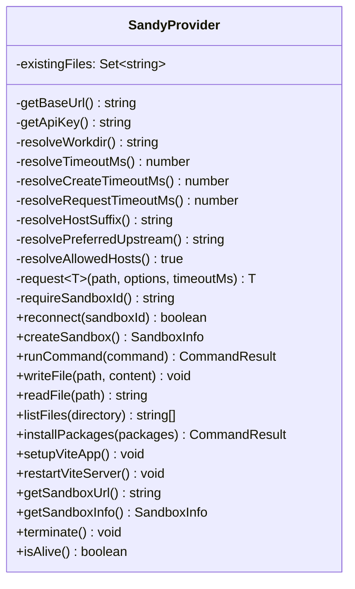
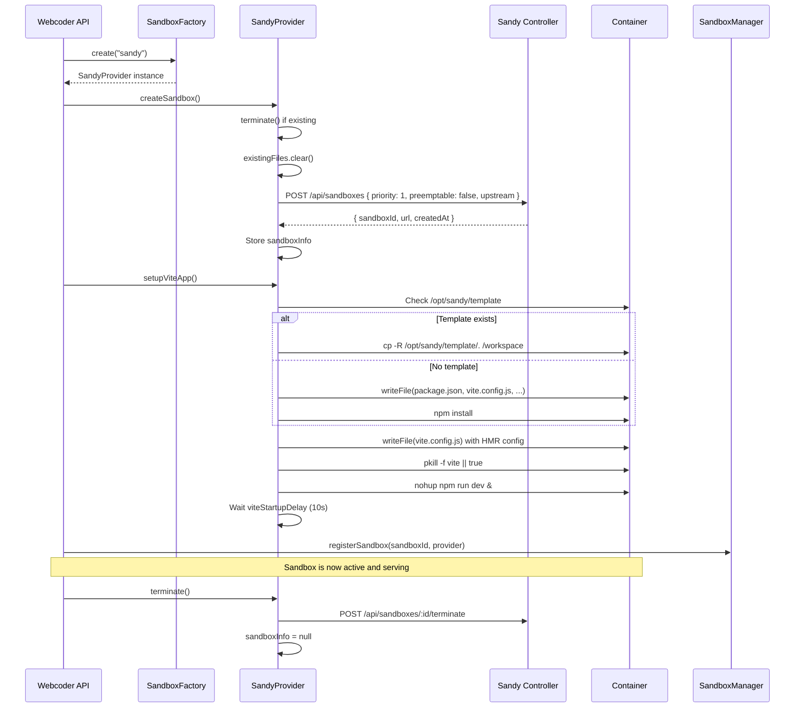

# Chutes Webcoder -- Sandy Sandbox Integration

This document covers the Sandy sandbox provider in depth: how Webcoder creates,
manages, and communicates with Sandy sandboxes to run AI-generated code in
isolated containers.

## SandyProvider Class

**Source:** `lib/sandbox/providers/sandy-provider.ts`

`SandyProvider` extends the abstract `SandboxProvider` base class and implements
all sandbox operations via HTTP calls to the Sandy Controller API.

### Class Structure



### HTTP Client

The provider uses the `undici` library's `Agent` for HTTP requests with
configurable timeouts. A dispatcher cache (`sandyDispatcherCache`) reuses
`Agent` instances per timeout value to avoid connection overhead:

```typescript
const sandyDispatcherCache = new Map<number, Agent>();

function getSandyDispatcher(timeoutMs: number): Agent {
  const cached = sandyDispatcherCache.get(timeoutMs);
  if (cached) return cached;
  const agent = new Agent({
    connectTimeout: timeoutMs,
    headersTimeout: timeoutMs,
    bodyTimeout: timeoutMs,
  });
  sandyDispatcherCache.set(timeoutMs, agent);
  return agent;
}
```

All requests go through the private `request<T>()` method which handles:
- Bearer token authentication via `SANDY_API_KEY`
- JSON serialization of request bodies
- Abort controller-based timeouts
- Detailed error messages including elapsed time and abort status

## Sandbox Lifecycle



### Create

`createSandbox()` calls `POST /api/sandboxes` on the Sandy Controller with:

```json
{
  "priority": 1,
  "preemptable": false,
  "upstream": "docker-primary"
}
```

- **priority: 1** -- HIGH priority for user-facing webcoder sessions
- **preemptable: false** -- do not preempt user sessions for batch work
- **upstream** -- optional preferred upstream from `SANDY_PREFERRED_UPSTREAM`

The create timeout defaults to 240 seconds (`appConfig.sandy.createTimeoutMs`).

### Reconnect

`reconnect(sandboxId)` attempts to reattach to an existing sandbox by calling
`GET /api/sandboxes/:id`. If the sandbox still exists, it reconstructs
`sandboxInfo` without creating a new container.

### Exec (runCommand)

`runCommand(command)` calls `POST /api/sandboxes/:id/exec` with:

```json
{
  "command": "npm run build",
  "cwd": "/workspace",
  "timeoutMs": 600000
}
```

Returns `CommandResult` with stdout, stderr, exitCode, and success flag.

### File Operations

| Method | Sandy API Endpoint | Purpose |
|--------|-------------------|---------|
| `writeFile(path, content)` | `POST /api/sandboxes/:id/files/write` | Write a file |
| `readFile(path)` | `GET /api/sandboxes/:id/files/read?path=...` | Read a file |
| `listFiles(directory)` | `GET /api/sandboxes/:id/files/list?path=...` | List directory |

The `writeFile` method tracks written files in the `existingFiles` set for
internal bookkeeping.

### Package Installation

`installPackages(packages)` runs `npm install` with optional `--legacy-peer-deps`
flag (enabled by default). After successful installation, it auto-restarts the
Vite dev server if `appConfig.packages.autoRestartVite` is true.

The install timeout is 180 seconds with a 5-second buffer for the HTTP request.

### Terminate

`terminate()` calls `POST /api/sandboxes/:id/terminate` and sets `sandboxInfo`
to null. Errors during termination are caught and logged but do not throw.

## Configuration

### Environment Variables

| Variable | Required | Default | Purpose |
|----------|----------|---------|---------|
| `SANDY_BASE_URL` | Yes | -- | Sandy Controller base URL |
| `SANDY_API_KEY` | No | -- | Bearer token for Sandy API auth |
| `SANDY_HOST_SUFFIX` | No | `.sandy.localhost` | Domain suffix for sandbox preview URLs |
| `NEXT_PUBLIC_SANDBOX_HOST_SUFFIX` | No | -- | Client-side sandbox host suffix |
| `SANDY_PREFERRED_UPSTREAM` | No | -- | Preferred upstream for sandbox creation |
| `SANDY_WORKDIR` | No | `/workspace` | Working directory inside sandbox |
| `SANDBOX_PROVIDER` | No | `sandy` | Which provider to use (`sandy`, `e2b`, `vercel`) |

### App Config (`config/app.config.ts`)

```typescript
sandy: {
  timeoutMinutes: 10,        // Command execution timeout
  vitePort: 5173,             // Vite dev server port
  viteStartupDelay: 10000,    // Wait for Vite to start (ms)
  createTimeoutMs: 240000,    // Sandbox creation timeout (ms)
  setupTimeoutMs: 240000,     // Vite setup timeout (ms)
  workingDirectory: '/workspace',
}
```

## Preferred Upstream Routing

The `preferredUpstream` parameter tells the Sandy Controller which backend
cluster to schedule the sandbox on. This is useful when:

- **Different upstreams serve different purposes**: e.g., `docker-primary` for
  user-facing IDE sessions vs. a batch upstream for background jobs.
- **Geo routing**: placing sandboxes closer to users.
- **Resource isolation**: keeping webcoder sandboxes on dedicated hardware.

The value is passed as the `upstream` field in the sandbox creation request:

```typescript
const data = await this.request('/api/sandboxes', {
  method: 'POST',
  body: {
    priority: 1,
    preemptable: false,
    upstream: this.resolvePreferredUpstream()
  }
}, this.resolveCreateTimeoutMs());
```

Resolution order:
1. `this.config.sandy?.preferredUpstream` (programmatic config)
2. `process.env.SANDY_PREFERRED_UPSTREAM` (environment variable)

## SandboxManager

**Source:** `lib/sandbox/sandbox-manager.ts`

The `SandboxManager` is a singleton that maintains an in-memory registry of
active sandboxes. Each browser session tracks its own `sandboxId` to prevent
sandbox sharing between concurrent users.

### Key Design Decisions

- **Session isolation**: The deprecated `getActiveProvider()` and
  `setActiveSandbox()` methods return null / no-op, forcing callers to use
  explicit `sandboxId` lookups.
- **Reconnection**: `getOrCreateProvider(sandboxId)` tries to reconnect to an
  existing sandbox before creating a new one.
- **Cleanup**: `cleanup(maxAge)` terminates sandboxes that have not been
  accessed within `maxAge` milliseconds (default 1 hour).
- **Global singleton**: Exported as both a module-level singleton and a
  `global.sandboxManager` reference for cross-module access.

## Sandbox Creation Flow with Retry

**Source:** `app/api/create-ai-sandbox-v2/route.ts`

The creation endpoint wraps sandbox creation in a retry loop (up to 5 attempts)
with exponential backoff:

```mermaid
flowchart TD
    A[POST /api/create-ai-sandbox-v2] --> B{sandboxId in body?}
    B -->|Yes| C[Restore existing sandbox]
    B -->|No| D[createSandboxWithRetry max=5]

    D --> E[createSandboxInternal]
    E --> F[SandboxFactory.create]
    F --> G[provider.createSandbox]
    G --> H[provider.setupViteApp]
    H --> I[Health check: echo sandbox-ready]
    I -->|Success| J[sandboxManager.registerSandbox]
    I -->|Failure| K{Retry?}
    K -->|Yes| L[Exponential backoff]
    L --> E
    K -->|No| M[Return 500 error]

    J --> N[writeProjectState]
    N --> O[Return { sandboxId, previewUrl }]

    C --> P{Provider found?}
    P -->|Yes| Q[Return sandbox info]
    P -->|No| R[Return 404]
```

Transient errors (DNS, connection refused, Bad Gateway, headers timeout) use
longer backoff delays (5-30 seconds) while other errors use shorter delays
(2-10 seconds).

## Preview URL Resolution

**Source:** `lib/server/sandbox-preview.ts`

For Sandy sandboxes, the preview URL is always a local API proxy route:

```typescript
function buildSandyPreviewUrl(sandboxId: string): string {
  return `/api/sandy-preview/${sandboxId}`;
}
```

This avoids CORS issues and allows the webcoder to serve sandbox content through
its own domain. The preview route also sets an `httpOnly` cookie
(`sandySandboxId`) for session tracking.

For non-Sandy providers (E2B, Vercel), the preview URL is the direct sandbox URL
returned by the provider.

## Vite HMR Configuration

The Vite config generated by `setupViteApp()` includes Hot Module Replacement
settings that work through the Sandy proxy:

```javascript
server: {
  host: '0.0.0.0',
  port: 5173,
  strictPort: true,
  hmr: {
    host: '<sandboxId><hostSuffix>',
    protocol: 'wss',       // or 'ws' for HTTP
    clientPort: 443         // or 80 for HTTP
  },
  origin: 'https://<sandboxId><hostSuffix>',
  allowedHosts: true,
  watch: {
    usePolling: true,
    interval: 1000
  }
}
```

The HMR WebSocket connects directly to the sandbox host (bypassing the API
proxy) for low-latency file change updates. File polling is enabled for
reliable change detection inside containers.

## Source Files

| File | Purpose |
|------|---------|
| `lib/sandbox/types.ts` | `SandboxProvider` abstract class, `SandboxInfo`, `CommandResult` |
| `lib/sandbox/factory.ts` | `SandboxFactory` with provider selection and fallback |
| `lib/sandbox/providers/sandy-provider.ts` | Full Sandy HTTP client implementation |
| `lib/sandbox/providers/e2b-provider.ts` | E2B sandbox provider |
| `lib/sandbox/providers/vercel-provider.ts` | Vercel sandbox provider |
| `lib/sandbox/sandbox-manager.ts` | In-memory sandbox registry |
| `lib/sandbox/utils.ts` | File write helpers with fallback strategies |
| `lib/server/sandbox-preview.ts` | Preview URL construction |
| `config/app.config.ts` | Sandy timeout, port, and path settings |
