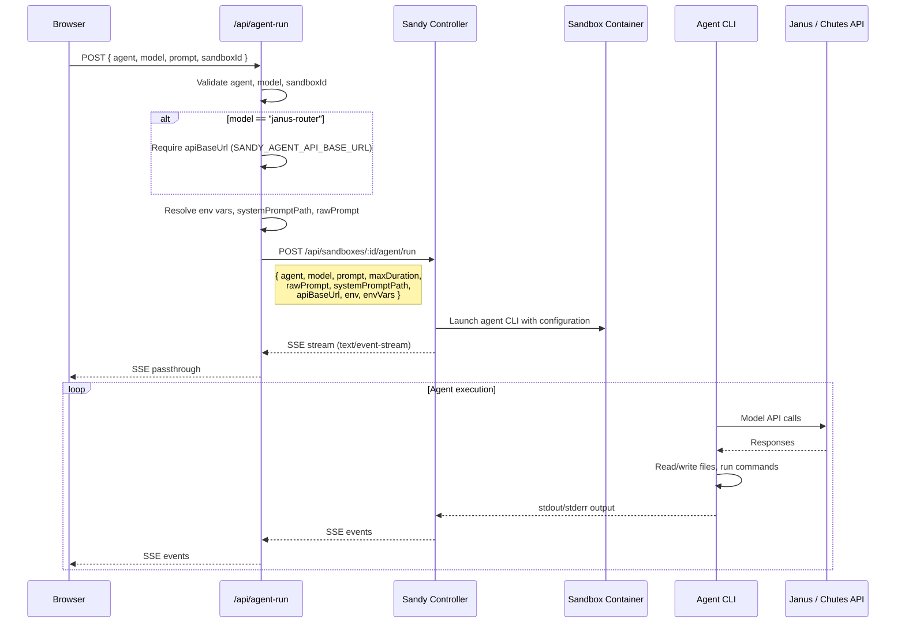
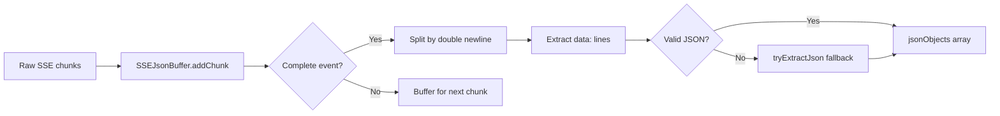
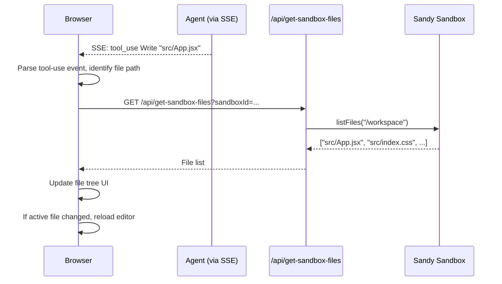
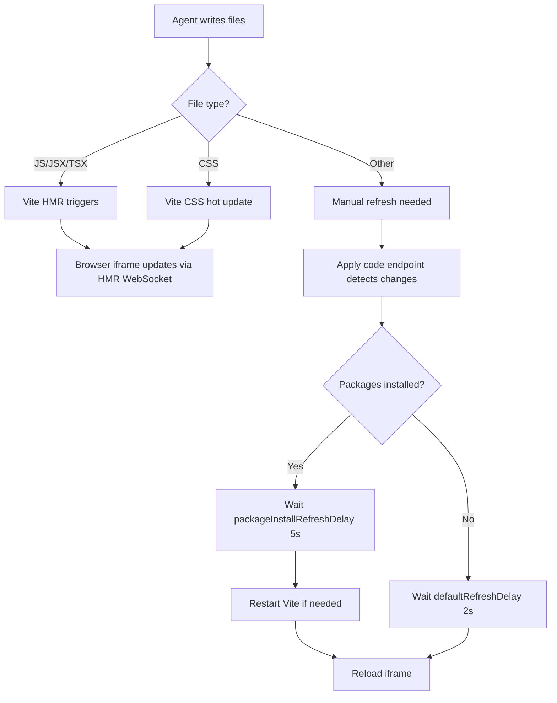

# Chutes Webcoder -- Agent Execution System

This document describes how Webcoder runs AI coding agents inside Sandy
sandboxes, streams their output to the browser, and applies the generated code
to the project.

## Agent Run API Endpoint

**Source:** `app/api/agent-run/route.ts`

The `/api/agent-run` endpoint is the primary interface for executing coding
agents. It acts as a thin proxy between the browser and Sandy's agent execution
API.

### Request Flow



### Request Parameters

```typescript
{
  agent: string;        // "claude-code" | "codex" | "aider" | "opencode" | "droid" | "openhands"
  model: string;        // Model ID from appConfig.ai.availableModels
  prompt: string;       // User's natural language instruction
  sandboxId: string;    // Active sandbox ID
  maxDuration?: number; // Max execution time in seconds (default: 1200)
  rawPrompt?: boolean;  // Skip Sandy's web-dev wrapper prompt
  systemPromptPath?: string;  // Path to system prompt file in sandbox
  apiBaseUrl?: string;  // Override the model API base URL
  env?: Record<string, string>; // Additional environment variables
}
```

### Environment Variable Resolution

The endpoint resolves several configuration values with a priority chain:

| Parameter | Resolution Order |
|-----------|-----------------|
| `apiBaseUrl` | Request body -> `SANDY_AGENT_API_BASE_URL` -> `SANDY_AGENT_ROUTER_URL` -> `JANUS_ROUTER_URL` -> `JANUS_MODEL_ROUTER_URL` |
| `systemPromptPath` | Request body -> `SANDY_AGENT_SYSTEM_PROMPT_PATH` -> `JANUS_SYSTEM_PROMPT_PATH` |
| `rawPrompt` | Request body -> `SANDY_AGENT_RAW_PROMPT` |
| `env.CHUTES_API_KEY` | Always injected from server `CHUTES_API_KEY` |

The `apiBaseUrl` is normalized to strip trailing slashes and `/v1` suffixes.

### GET Endpoint

`GET /api/agent-run` returns the list of available agents and models:

```json
{
  "agents": [
    { "id": "claude-code", "name": "Claude Code" },
    { "id": "codex", "name": "OpenAI Codex" },
    { "id": "aider", "name": "Aider" },
    ...
  ],
  "models": [
    "janus-router",
    "zai-org/GLM-4.7-TEE",
    "deepseek-ai/DeepSeek-V3.2-TEE",
    ...
  ]
}
```

## Agent Cancel

**Source:** `app/api/agent-cancel/route.ts`

The `/api/agent-cancel` endpoint sends a cancel signal to Sandy to stop a
running agent:

```
POST /api/agent-cancel
{ "sandboxId": "abc123" }

-> Sandy: POST /api/sandboxes/abc123/agent/cancel
```

## SSE Streaming Events

The agent run endpoint returns a `text/event-stream` response that is a direct
passthrough of Sandy's SSE output. The browser parses these events to display
real-time progress.

### Event Types from Sandy

Sandy sends events with the following types:

| Event Type | Description | Data Fields |
|------------|-------------|-------------|
| `status` | Agent lifecycle status | `{ message: string }` |
| `output` | Raw agent stdout/stderr | `{ text: string }` |
| `agent-output` | Structured agent output | `{ data: { type, ... } }` |
| `error` | Error during execution | `{ error: string }` |
| `complete` | Agent finished | `{ exitCode: number, success: boolean }` |

### Agent Output Types (within `agent-output`)

For Claude Code agents, the `data` field contains structured events:

| `data.type` | Meaning |
|-------------|---------|
| `system` | System init message (skipped) |
| `assistant` | Model response with content blocks |
| `user` | Tool results (skipped) |
| `result` | Final result text |
| `error` | Agent error |

Content blocks within `assistant` messages:

| Block Type | Purpose |
|------------|---------|
| `text` | Model's text response |
| `thinking` | Internal reasoning (shown as "Thinking...") |
| `tool_use` | Tool invocations (Read, Write, Edit, Bash, Glob, Grep, Task) |

### SSEJsonBuffer

**Source:** `lib/agent-output-parser.ts`

The `SSEJsonBuffer` class handles chunked JSON data across multiple SSE events.
It accumulates data until a complete JSON object is found:



Key features:
- Splits SSE events by `\n\n` delimiter
- Extracts `data:` prefixed lines from each event
- Attempts JSON parse, with a brace-matching fallback for truncated data
- `flush()` method processes any remaining buffered data at stream end

## Agent Output Parser

**Source:** `lib/agent-output-parser.ts`

The output parser converts raw agent output into user-friendly messages for the
chat interface.

### ParsedMessage Types

```typescript
type ParsedMessage = {
  type: 'user-friendly' | 'status' | 'thinking' | 'tool-use' | 'error' | 'code' | 'skip';
  content: string;
  metadata?: {
    toolName?: string;
    filePath?: string;
    thinking?: boolean;
    duration?: number;
  };
};
```

### Claude Code Output Parsing

`parseClaudeCodeOutput(data)` handles the structured JSON output from Claude
Code:

1. **System messages** -- skipped (internal init data)
2. **User messages** -- skipped (tool results)
3. **Result messages** -- extracted if plain text
4. **Assistant messages** -- parsed for content blocks:
   - `thinking` blocks -> `{ type: 'thinking', content: 'Thinking...' }`
   - `text` blocks -> `{ type: 'user-friendly', content: '...' }`
   - `tool_use` blocks -> formatted as user-friendly descriptions:
     - `Write` / `Edit` -> "Creating/Editing file: path"
     - `Read` -> "Reading file: path"
     - `Bash` -> "Running: command" (for meaningful commands)
     - `Glob` -> "Searching files: pattern"
     - `Grep` -> "Searching \"pattern\" in path"
     - `Task` -> "Working on: description"
5. **Error messages** -> `{ type: 'error', content: '...' }`

### Plain Text Output Parsing

`parsePlainTextOutput(text)` handles non-JSON output from agents like Codex and
Aider:

- Error patterns (`error:`, `failed:`, `exception:`) -> `{ type: 'error' }`
- Status indicators (`>`, checkmarks, "reading"/"writing"/"running") -> `{ type: 'status' }`
- Everything else -> `{ type: 'user-friendly' }`

### Output Cleaning

`cleanAgentOutput(text)` strips:
- ANSI escape codes
- Carriage returns
- Control characters
- Raw JSON fragments (system init, partial messages)
- Noise patterns (line numbers, prompt characters, agent command prefixes)

## File Tree Updates

When an agent writes or modifies files in the sandbox, the browser updates its
file tree by polling or requesting the file list:



The parser extracts file paths from `tool_use` events (both `Write` and `Edit`
tool names, with `file_path` or `path` input fields) so the UI can highlight
which files are being created or modified in real time.

## Code Preview Auto-Reload

After code is applied to the sandbox, the preview iframe reloads to show the
updated application:



### Refresh Timing

From `config/app.config.ts`:

```typescript
codeApplication: {
  defaultRefreshDelay: 2000,         // 2s after code apply
  packageInstallRefreshDelay: 5000,  // 5s when packages are installed
  enableTruncationRecovery: false,   // Disabled (false positives)
  maxTruncationRecoveryAttempts: 1,
}
```

### Vite HMR Path

For Sandy sandboxes, Vite HMR operates through a WebSocket connection to the
sandbox host:

```
wss://<sandboxId><hostSuffix> (production)
ws://<sandboxId><hostSuffix>  (development)
```

This connection is separate from the API proxy and provides sub-second updates
for JavaScript and CSS changes. The Vite config uses `allowedHosts: true` and
polling-based file watching for container compatibility.

## Agent Speed Reference

Typical execution times for different agent/model combinations (from project
testing):

| Agent | DeepSeek V3.2 | GLM-4.7 |
|-------|---------------|---------|
| Aider | ~10s | Works |
| Codex | ~15-160s | ~13s |
| Claude Code | >60s (slower) | >60s (slower) |
| OpenHands | ~30s | Works |

## Source Files

| File | Purpose |
|------|---------|
| `app/api/agent-run/route.ts` | Agent execution endpoint with SSE passthrough |
| `app/api/agent-cancel/route.ts` | Agent cancellation endpoint |
| `lib/agent-output-parser.ts` | SSE parsing, JSON buffering, output formatting |
| `lib/ai-response.ts` | AI response processing utilities |
| `config/app.config.ts` | Agent list, model list, timing configuration |
